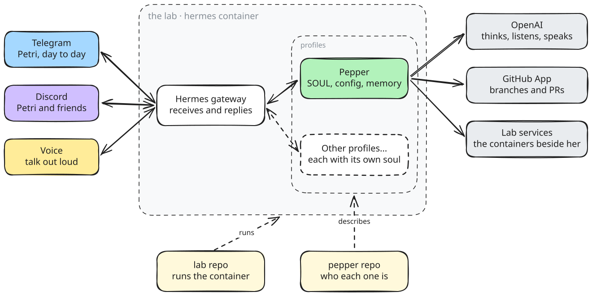

<h1 align="center">🐦 pepper</h1>

<br>

<h3 align="center">The workstation for the Hermes agents in my lab.<br>What each one is, what it's wired to, and why</h3>

<p align="center">
  
</p>

<br>

## About

> **TL;DR:** Pepper is the agent that runs in my [lab](https://github.com/Petri-Hub/lab): she sets reminders and crons, notifies me on Telegram and Discord, opens PRs on my repos, and reaches my Gmail, Calendar and Drive. The lab runs her container. This repo keeps what runs inside it, the personality, the model and every platform she's wired to, written so I can tell what's configured without opening a YAML file.

## How it works

<p align="center">
  
</p>

Every message, from Telegram, Discord or voice, goes through the Hermes gateway to Pepper, who thinks with OpenAI and works on GitHub and the lab. The lab repository keeps the container running, and this one describes who each profile is.

## Profiles

| &nbsp;&nbsp;&nbsp;&nbsp;&nbsp; | Profile | What it is | Model | Talks on |
|:---:|---|---|---|---|
| 🐦 | [Pepper](profiles/pepper/CONFIG.md) | My general-purpose assistant: reminders, crons, GitHub, research, errands | OpenAI | Telegram · Discord · voice |

## Philosophy

**Decisions, not files.**  
Hermes fills most of an agent's configuration with its own defaults. What's worth keeping is what I actually chose, so everything else stays out. The less configuration it takes to get the same agent, the better.

**Intent over implementation.**  
When I ask for voice transcription in Portuguese, what matters is the provider and the model. The small adjustments made along the way are details, and they only get recorded when they were the point.

**Readable before reproducible.**  
Anyone should be able to open a profile and understand who the agent is, where it talks and why, without knowing Hermes. The configuration comes after the explanation, never instead of it.

**Every change has a story.**  
Each profile keeps a changelog written in the words I used to ask for it, so months later I still know why something is there, and not only that it is.

**The lab owns the body, this repo owns the mind.**  
The container, the ports and the secrets belong to the lab. Here lives who each agent is: the personality, the model, the platforms and how it behaves.

**What moves fast stays out.**  
Skills, memories and reminders change every day, and Hermes takes care of them on its own. Keeping them here would only produce a copy that's always out of date.

**No credentials.**  
Only placeholders. The real values live in the lab and never reach this repository.

## What's inside

```sh
├── .claude/rules      # how agents write profiles and .env files here
├── .github/workflows  # publishes Pepper's sandbox image, and refreshes her Wakapi card below
├── assets             # the diagram, as an editable Excalidraw file and its SVG
├── profiles
│   └── <name>
│       ├── .env.example   # the variables the agent needs, with placeholders
│       ├── avatar.png     # its picture on every platform
│       ├── CHANGELOG.md   # every change, in the words I asked for it
│       ├── CONFIG.md      # what's configured, and why, with the settings that do it
│       ├── SOUL.md        # who the agent is, and the rules it follows
│       └── sandbox        # Pepper's Modal image: the tools her terminal runs with
└── AGENTS.md          # the conventions for working in this repository
```

## Technologies

| &nbsp;&nbsp;&nbsp;&nbsp;&nbsp; | Technology | Used for |
|:---:|---|---|
|  | [Hermes](https://hermes-agent.nousresearch.com/docs/) | The agent framework from Nous Research that every profile runs on, with memory, skills, crons and messaging built in |
|  | [OpenAI](https://platform.openai.com/docs) | The model Pepper thinks with, and the voice she listens and speaks with |
|  | [Telegram](https://core.telegram.org/bots) | Where I talk to Pepper day to day, and where her reminders reach me |
|  | [Discord](https://discord.com/developers/docs) | Where Pepper hangs out with my friends, and where they can ask her things too |
|  | [GitHub](https://docs.github.com/en/apps) | Where Pepper works on my repositories through her own GitHub App, always through pull requests |
|  | [Google Workspace](https://developers.google.com/workspace) | Gmail, Calendar and Drive, reached with an OAuth client of mine that Pepper holds her own token for |
|  | [Notion](https://developers.notion.com/docs/mcp) | My pages and databases, reached over Notion's hosted MCP server as her first MCP connection |
|  | [Vercel](https://vercel.com/docs/mcp) | My deployments, logs and projects, over Vercel's hosted MCP server |
|  | [Sentry](https://docs.sentry.io/product/sentry-mcp/) | Issues and stack traces from my projects, over Sentry's hosted MCP server |
|  | [Canva](https://www.canva.dev/docs/mcp/) | My designs, folders and brand templates, over Canva's hosted MCP server |
|  | [Miro](https://developers.miro.com/docs/connecting-to-miro-mcp) | My boards and spaces, reached over Miro's hosted MCP server |
|  | [Modal](https://modal.com/docs) | The cloud sandbox her shell commands run in, so nothing she executes touches the lab host |
|  | [Docker](https://docs.docker.com/) | The container in the lab that Pepper lives in |

## Roadmap

What's already in place:

- ✅ Hermes running in the lab, in a container of its own
- ✅ OpenAI as the model provider, replacing OpenRouter
- ✅ Telegram, where I talk to her day to day
- ✅ Discord, where my friends can talk to her too
- ✅ Voice, so she understands voice notes, answers out loud and holds live conversations
- ✅ Her own GitHub App, working on my repositories through pull requests
- ✅ Gmail, to read, send and sort my email
- ✅ Google Calendar, to know my schedule and put things on it
- ✅ Google Drive, to find, read and share my documents
- ✅ Notion, over MCP, reading and writing my pages and databases
- ✅ Vercel, over MCP, for my deployments, logs and projects
- ✅ Sentry, over MCP, for issues and stack traces
- ✅ Canva, over MCP, for my designs and brand templates
- ✅ Miro, over MCP, reading and editing my boards
- ✅ MCP servers, so she can reach tools that speak the protocol
- ✅ Crons and reminders, delivered to Telegram or Discord
- ✅ A personality, with rules on who she trusts and what she never shares
- ✅ Her own avatar, the same bird on every platform
- ✅ This repository, keeping her configuration readable
- ✅ Backups of who she is — her soul, settings, skills, crons and memories — on the pendrive that already holds the game saves
- ✅ Modal as her terminal backend, so her shell commands run in a disposable cloud sandbox instead of on the lab host
- ✅ A fallback model, so a rate limit or a provider error hands over to a second model instead of ending the turn
- ✅ FAM's website, through skills of her own that sign in from the vault, read the inbox and find open activities
- ✅ A Modal image of her own, carrying the Python libraries and the CLIs her skills reach for, and reporting her coding work to Wakapi and AI Memory
- ✅ Claude Code in her sandbox, under my personal account, so she delegates coding to it instead of spending her own tokens
- ✅ AI Memory as her long-term memory, the same wiki Claude Code writes to on every machine I code on
- ✅ Wakapi tracking her own time, her conversations and crons as well as the coding she delegates, under a Wakapi user of her own

What comes next:

- ❌ Plugins: a look through what exists for Hermes, the general-purpose ones and a connection to Excalidraw
- ❌ A reshaped `SOUL.md`, and the files around it: who I am, my repositories, and what she should know without being told
- ❌ Real routines — personalizations, schedules and proactive work she does for me instead of waiting to be asked
- ❌ Spotify control, so she can play, pause and queue music for me
- ❌ Her GitHub App, which is misbehaving and needs a proper look

## Activity

Pepper's own time, from her Wakapi user in the lab: her conversations and crons, and the coding she hands to Claude Code in her sandbox. Refreshed every night, and never counted in my own stats.

<!--START_SECTION:waka-->

```rust
Total Time: 0 hrs 44 mins

Unknown    0 hrs 44 mins   ████████████████████████▓   99.21 %
Markdown   0 hrs 0 mins    ▒░░░░░░░░░░░░░░░░░░░░░░░░   00.79 %
Python     0 hrs 0 mins    ░░░░░░░░░░░░░░░░░░░░░░░░░   00.00 %
```

<!--END_SECTION:waka-->

## References

- [Hermes Agent](https://hermes-agent.nousresearch.com/docs/): the documentation for the framework every profile runs on
- [Hermes Agent on GitHub](https://github.com/NousResearch/hermes-agent): the source code, from [Nous Research](https://nousresearch.com)
- [OpenAI API Platform](https://platform.openai.com/docs): the models behind Pepper's thinking, transcription and voice
- [Telegram Bot API](https://core.telegram.org/bots/api): how Pepper's Telegram bot talks to Telegram
- [Discord Developer Portal](https://discord.com/developers/applications): where Pepper's Discord bot is registered
- [GitHub Apps](https://docs.github.com/en/apps): how Pepper gets her own identity on GitHub
- [Google Workspace skill](https://hermes-agent.nousresearch.com/docs/user-guide/skills/bundled/productivity/productivity-google-workspace): the bundled Hermes skill that gives Pepper Gmail, Calendar and Drive
- [Notion MCP](https://developers.notion.com/docs/mcp): the hosted server Pepper reaches Notion through
- [Vercel MCP](https://vercel.com/docs/mcp): the hosted server Pepper reaches Vercel through
- [Sentry MCP](https://docs.sentry.io/product/sentry-mcp/): the hosted server Pepper reaches Sentry through
- [Canva MCP](https://www.canva.dev/docs/mcp/): the hosted server Pepper reaches Canva through
- [Miro MCP](https://developers.miro.com/docs/connecting-to-miro-mcp): the hosted server Pepper reaches Miro through
- [MCP in Hermes](https://hermes-agent.nousresearch.com/docs/user-guide/features/mcp): how Pepper's MCP servers are configured and authorized
- [Modal](https://modal.com/docs): the cloud sandbox Hermes sends her terminal commands to
- [Docker](https://docs.docker.com/): what runs Pepper's container in the lab
- [lab](https://github.com/Petri-Hub/lab): the homelab that hosts her
- [Wakapi](https://wakapi.dev): the self-hosted time tracker her coding reports to, and where this card's numbers come from
- [waka-readme](https://github.com/athul/waka-readme): the action that writes the Activity card from Wakapi's stats
- [ai-memory](https://github.com/akitaonrails/ai-memory): the memory server she shares with Claude Code, through the [community Hermes plugin](https://github.com/MrLuciano/ai-memory-hermes-plugin)
